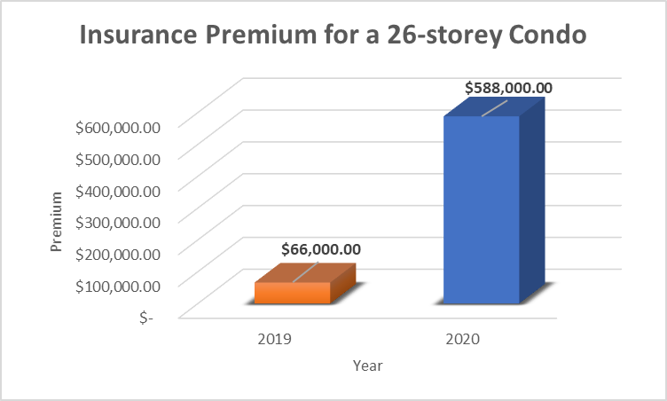

# Homework_1_VincentWen_Fintechbootcamp
# Case Study of "Alert Labs" 

##Overview and Backgroud
[Alert Labs](https://alertlabs.com/) is an IoT technology company focused on smart building sensors for water monitoring, leak and flood protection. Alert Labs was founded jointly by [George Tsintzouras](https://www.linkedin.com/in/georgetsintzouras/), the CEO of Alert Labs, and [Ruth Casselman](https://www.linkedin.com/in/ruth-casselman-b1588428/), the Chief Operating Officer at Alert Labs, and [Kevin Wright](https://www.linkedin.com/in/kevinrobertsonwright/),the Vice President of Engineering and CTO at Alert Labs, in 2015. The company is located in [Kitchiner, Ontario](https://en.wikipedia.org/wiki/Kitchener,_Ontario) allowing a cost effective work space, and also close to one of the biggest codo apartment market in Canada.

Alert Labs designs and manufactures affordable and reliable sensor-networks based on their cutting edge property protection technology. Their products are easy to install and use. It only requirs a cellular network to provide real-time monitoring and 24/7 alerts with analytics to reduce property damage, repair costs and utility bills for residential and commercial properties.

Back in 2015, Alert Labs received its seed round funding of CAD 70,000 from [Accelerator Center](https://www.acceleratorcentre.com/), which is the No.1 ranking private business accelerator in the Canada and have been named Accelerator of the Year in both 2018 and 2019. The Grant and Angel round funding was invested by [Communitech](https://www.crunchbase.com/organization/communitech) and [Golden Triangle Angle Network](https://www.crunchbase.com/organization/golden-triangle-angel-network) repectively with the funding amount undisclosed. In 2017, Alert Labs was funded by [Intact Ventures](https://www.crunchbase.com/organization/intact-ventures), [Hedgewood](https://www.crunchbase.com/organization/hedgewood), [Garage Capital](https://www.crunchbase.com/organization/garage-capital) and [BDC Venture Capital](https://www.crunchbase.com/organization/bdc-venture-capital), with the lead investor being Intact Ventures. The total disclosed funding amount is CAD 156,600.

##Business Activities
Alert Labs is building affordable and reliable sensor-networks for residential and commercial property owners. Its simple to deploy sensors that can be used on almost every water-involved appliance to monitor water leaks, floods, power issues, and other events. Also, alerts and data analytics can be delivered via cellular network to your smartphone and email. 

After COVID-19 hit, many businesses are closed, and commercial properties are left unattended; Alerts Labs' smart sensors are designed to help the owner monitor their properties remotely. The owners can check the temperature, power usage, water usage and leak status and receive an alert on the phone or computer for any unusual activity. Doing so can reduce the risk of exposure for maintenance staff because they don't have to check around.

The insurance premium for a condo apartment in Canada skyrocketed in recent years. One extreme example is a 26-storey condominium's insurance premium has been rocked by an astronomical 780% increase compared to the previous year, with its annual rate jumping from 66,000 in 2019 to 588,000 in 2020. See the below chart for comparison.

Rising replacement values and more claims mainly cause such a crisis. Even though the condo insurance market is growing, fewer insurers want to participate in this market when other segments are more profitable. As the rising of insurance premium has no sign of slow down, Alert Labs's smart sensors will help home-owner and property managers save thousands of dollars and allow insurers to regain confidence in this market, thus helping the market return equilibrium.

Products offered by Alert Labs are as follow:
Product Name| Product Image
------------|--------------
Flowie & Flowie-o (water flow sensors) | 
Floodie (flood sensor) | 
Shuttie(Automatic water shutoff valve) |
Sumpie (Sump pump sensor) |
Sentree(A/C Monitoring system) | 

Its product is designed to be universal and can fit most water-related appliances manufactured in the past 30 years. And its customer base covers an extensive range from homeowners, property managers, Residential multifamily owners, city buildings to schools and restaurants.

Most of the utility sensors on the market are not as "smart" as Alert Labs sensors. They only work individually and cannot send alerts and detect anomalies in a timely manner. Alerts Labs has an integrated platform to display all the connected sensor and their data analytics, end users can monitor all the status in one place. The advantage of easy-to-install and easy-to-use really set Alert Labs's sensor apart from others. Also Alert Labs sensors does not require WIFI connection to send off data, instead, it used cellular network to send date to the user. This enable it to continue to work during power outage and places without WIFI coverage. The data is collectored munite by minute according to sensor type. Then the sensor learns normal usage patterns and provide 24 hours monitoring. Machine learning and predictive analytics can generate actionable insigts for user. Alert Labs sensor also include a varity of sensor to provide accuate analysis and predections, such as a combination of pressure sensor, temperture sensor and viberation sensor is used on Sentree, the A/C Monitoring system.

## Landscape
Alert Labs is in the insurtech domain, mainly focused on the property and casualty (P&C) insurance sector. The landscape of this sector is mostly impacted by COVID-19; in such difficult suitation, insurance companies are looking for ways to implement more technologically advanced devices or systems to increase efficiecy and reduce cost. It is safe to say that at least a part of insurance companies' growth is thanks to the use of analytics, automation and Insurtech solutions focused on optimizing specific tasks in the value chain.

We can also categorize the Alert Labs sensor as a smart home device. The Smart sensors market in canada is expected to grow in the next few years. Advancement in technology has led to the emergence of small size sensors with optimal performance and reliability. Technological advances, increasing Demand for Low-cost, High Performance and Reliable Sensors are driving the market forward. The need for Smart Sensor in Canada is expected to reach US$0.30 million in 2018, growing at the rate of 10% from the period 2014-2020 

Alert Labs sensor's unique features help it elimated most of the competition. [Sensorsuite](https://www.sensorsuite.com/) is one of the major competitors for Alert Labs. 

## Results
Alert Labs' product filled the gap between in-home use, wifi powered sensor and traditional machinecial indicators, making it a household enssical item. Both property managers and property and casualty (P&C) insurance campanies benefited from the continuous monitoring, problem prediction and instant alert. 

Sale valume is the best metrics to measure its success, unfortuanly the sales data is very limit. However, the funding sturcture from the last round can also reflect its success and great pentioal. With Intact Ventures, a sub-organization of Intact Financial corporation, as the lead investor, we can see that property and casualty (P&C) insurance companies will work more closly with Alert Labs and allow Alert Labs to gain an even more outstanding market share.

## Recommendations

If I were to advise Alert Labs, I would recommed two things:

first is on the software level, since all the data from the sensor will be collected, we can dive deep into those data with users' permison. Using big data analysis and machine learning to build the map with a different layer of data and make for personlized suggestions to the user. For example, using all the "pipe broken data" to create a detailed map corrsponding to the user's loction, if an aera has multiple pipe breaks, it may be caused by water pressure in the main water instead of individual home wate pipe.

Simple data mapping will cause a massive margine of error beause this type of analysis needs to consider infustructure age, time of the day, season and human error 

Second is working more closly with the insurance company, maybe offering the sensor as a buldle with their insurance policy.

## Reference

The accelerator centre - startups built to scale. (n.d.). Retrieved February 14, 2021, from https://www.acceleratorcentre.com/
Alert Labs - Funding, financials, valuation &amp; investors. (n.d.). Retrieved February 14, 2021, from https://www.crunchbase.com/organization/alert-labs/company_financials

Alert Labs. (n.d.). Fresh perspectives: Alert Labs Launches latest product in sensor suite. Retrieved February 14, 2021, from https://alertlabs.com/blogs/news/fresh-perspectives-alert-labs-launches-latest-product-in-sensor-suite

Alert Labs. (n.d.). Smart building sensors for water &amp; HVAC. Retrieved February 14, 2021, from https://alertlabs.com/
Apr 21, 2. (2021, January 20). Alert Labs Announces INTACT ventures as strategic investor. Retrieved February 14, 2021, from https://www.insurance-canada.ca/2017/04/21/alert-labs-announces-intact-ventures-as-strategic-investor/

Canada smart Sensors Market REPORT: Industry - SIZE, Share, trends, ANALYSIS, FUTURE, GROWTH, opportunities, forecast, OVERVIEW, outlook, Potential: CANADA optical Spectroscopy MARKET: Canada Cmos MARKET: Canada MEMS Market. (n.d.). Retrieved February 14, 2021, from https://www.mordorintelligence.com/industry-reports/canada-smart-sensors-market-industry

Department, P., &amp; 22, J. (2021, January 22). Smart home market size CANADA 2018-2023. Retrieved February 14, 2021, from https://www.statista.com/statistics/1076345/canada-revenue-smart-home-market/

InsurTech Spotlight: Alert Labs. (2020, May 13). Retrieved February 14, 2021, from https://www.insurance-canada.ca/insurtech-spotlight/alert-labs/

Intact ventures - Crunchbase Investor profile &amp; investments. (n.d.). Retrieved February 14, 2021, from https://www.crunchbase.com/organization/intact-ventures

Kitchener, Ontario. (2021, February 12). Retrieved February 14, 2021, from https://en.wikipedia.org/wiki/Kitchener,_Ontario

No simple solutions to skyrocketing condo insurance Costs, report FINDS | CBC News. (2020, December 18). Retrieved February 14, 2021, from https://www.cbc.ca/news/canada/british-columbia/condo-insurance-costs-financial-services-authority-1.5848185

Oct 3, 2. (2021, January 20). Alert Labs Expands Water tech WITH FLOWIE-O &amp; Shuttie saving water &amp; damage. Retrieved February 14, 2021, from https://www.insurance-canada.ca/2019/10/03/alert-labs-smart-water-solutions-flowie-shuttie/

Posted Apr 22, 2. (2020, October 29). Managing your properties from offsite during the pandemic. Retrieved February 14, 2021, from https://www.insurance-canada.ca/2020/04/22/alert-labs-managing-properties-from-offsite-during-pandemic/

Sharma, N. (2020, November 16). Condo insurance premiums on the rise. Retrieved February 14, 2021, from https://www.canadianrealestatemagazine.ca/news/condo-insurance-premiums-on-the-rise-334345.aspx

Stephen PunwasiCo-Founder and chief data nerd at Better Dwelling. Named a top influencer in finance and risk by Thomson-Reuters. (2020, October 08). Why Canada's CONDO "Insurance CRISIS" should make investors Nervous. Retrieved February 14, 2021, from https://betterdwelling.com/why-canadas-condo-insurance-crisis-should-make-investors-nervous/

